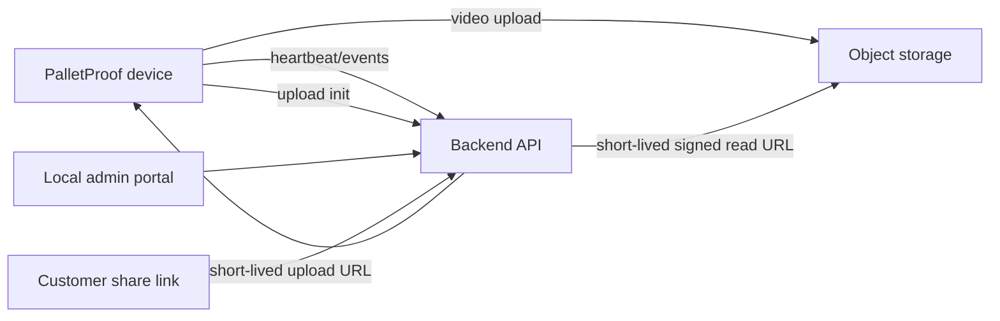

# PalletProof backend-platform

Dette er et oplæg til platformen omkring mange PalletProof-enheder på flere lagre. Fokus er drift, adgangsstyring, videooverblik og kontrolleret deling af enkelte videoer med kunder.

## Målbillede

Et lager kan have 10-30 folieringsmaskiner og dermed 10-30 enheder på samme lokation. En lokal admin skal kunne se:

- hvilke enheder der er online/offline
- seneste scan, optagelse og upload pr. enhed
- fejlstatus, diskforbrug, softwareversion og netværkstype
- videoer filtreret på ordre, tid, enhed, site og status
- en enkel handling til at dele én specifik video med en kunde

Platformen skal være multi-tenant fra starten: en bruger hos lager A må aldrig kunne se video eller status fra lager B, medmindre vi eksplicit giver adgang.

## Anbefalet arkitektur



Første produktionsversion kan fortsætte med SFTP-upload, men platformen bør på sigt flytte video-upload til HTTPS med korte upload-URLs. Det giver bedre adgangsstyring, audit log og deling end flade SFTP-foldere.

## Dataobjekter

Minimumsmodellen bør være:

- `organizations`: juridisk kunde eller lagerpartner.
- `sites`: fysisk lokation, fx Rhenus Horsens.
- `devices`: serienummer, site, status, softwareversion, sidste heartbeat, aktiveringstidspunkt.
- `device_events`: scan, recording_started, recording_finished, upload_started, upload_finished, error, update_started, update_finished.
- `videos`: serienummer, ordre, start/slut, storage path, filstørrelse, varighed, uploadstatus, privacystatus.
- `users`: admins og interne SweetSpot-brugere.
- `memberships`: brugerroller pr. organization/site.
- `video_shares`: delbare links med token, udløbstid, adgangslog og mulighed for tilbagekaldelse.
- `audit_log`: hvem så, delte, slettede eller ændrede hvad.

## Roller

- `SweetSpot owner`: global drift, alle kunder og alle enheder.
- `SweetSpot support`: supportadgang, men begrænset adminfunktion.
- `Organization admin`: kan administrere sites og brugere for sin organisation.
- `Site admin`: kan se status og videoer for én fysisk lokation.
- `Viewer`: kan se videoer/status, men ikke ændre opsætning.
- `Customer share`: kan kun se den ene delte video via et tidsbegrænset link.

## Device provisioning

Provisioning-flowet bør være:

1. SweetSpot eller kundens portal opretter device-serienummer og vælger organization/site.
2. Backend genererer en one-time activation token og en QR-kode.
3. QR-koden indeholder serienummer, site/customer, WiFi SSID/password, API-base-URL og udløbstid.
4. Enheden scanner QR-koden første gang.
5. Enheden kalder `POST /device/activate` med token og serienummer.
6. Backend udsteder en permanent device credential.
7. Enheden gemmer kun device credential og ikke WiFi-password i appens identity-fil.

QR-koden bør enten være signeret eller kun indeholde en kortlivet activation token, som backend validerer. Den må ikke kunne genbruges på en anden enhed.

## Device API

Foreslåede endpoints:

- `POST /device/activate`: byt provisioning-token til device credential.
- `POST /device/heartbeat`: online-status, diskforbrug, IP/netværkstype, softwareversion, scannerstatus, kamerastatus.
- `POST /device/events`: driftshændelser og fejl.
- `POST /device/videos/initiate-upload`: opret video-record og få upload-URL.
- `POST /device/videos/{id}/complete`: marker upload færdig med størrelse, varighed og checksum.
- `GET /device/software/current`: seneste godkendte softwareversion og download/update-instruktion.

Heartbeat bør sendes ca. hvert 30.-60. sekund i normal drift og straks ved fejl.

## Admin portal

De vigtigste skærme:

- Fleet overview: alle enheder med farvestatus, site, sidste heartbeat og seneste fejl.
- Site dashboard: én lokation med 10-30 enheder, filtrering på maskine/status.
- Device detail: kamera/scanner/upload-status, softwareversion, lokal kø og seneste events.
- Video search: ordre, dato, site, enhed, uploadstatus og delingsstatus.
- Video detail: afspilning, metadata, audit log og knap til del link.
- Share management: opret, kopier, udløb, tilbagekald og se adgangslog.
- Provisioning: opret enhed, vælg site, generer QR-kode, se om den er aktiveret.
- Scanner sleep time: pr. enhed kan admin sætte aktive tidsvinduer og ugedage, så scanneren ikke står og blinker uden for driftstid.

## Video storage og deling

Videoer bør ligge i object storage, ikke i databasen. Databasen gemmer metadata og storage path.

Storage path bør indeholde tenant/site/device for drift, men må ikke være adgangskontrollen i sig selv:

```text
organizations/{org_id}/sites/{site_id}/devices/{serial}/videos/{video_id}.mp4
```

Deling med kunde bør ske sådan:

1. Admin vælger én video og udløbstid.
2. Backend opretter et random share-token.
3. Kunden åbner et PalletProof-link, ikke en permanent storage-URL.
4. Backend validerer token og returnerer en kortlivet signed read URL.
5. Hver adgang logges.

Default bør være 7-30 dages udløb og mulighed for manuel tilbagekaldelse.

## Softwareopdatering

Første robuste model:

- Enheden sender sin `software_version` og sidste installerede `update_id` i heartbeat.
- GitHub indeholder en update-manifest med `policy = force` eller `policy = night`.
- `force` installeres så snart enheden er idle.
- `night` installeres kun når enheden er idle i det konfigurerede nattevindue.
- Enheden henter kun update-instruktioner fra en kendt URL.
- Opdatering installeres med fast-forward, så lokale kodeændringer ikke overskrives tavst.
- Når backend er klar, bør backend kunne overstyre rollout pr. site/enhed, så kritiske opdateringer kan rulles ud kontrolleret.

Direkte `git pull` på produktionsenheder er enkelt, men ikke ideelt på sigt. Release artifacts med checksum/signatur giver bedre kontrol.

## Status og alarmer

Der bør laves alarmer for:

- ingen heartbeat i mere end 5 minutter
- upload-kø vokser
- diskforbrug over 80%
- kamera ikke fundet
- scanner ikke fundet
- scanner i sleep time uden for aktivt vindue
- gentagne uploadfejl
- softwareopdatering fejlede
- mange videoer uden matchende ordreformat

Alarmer kan først vises i adminportalen og senere sendes som email/Teams.

## GDPR og retention

Vigtige standarder:

- Begræns kameravinkel fysisk, så personer ikke filmes unødigt.
- Brug rollebaseret adgang og audit log.
- Del links tidsbegrænses og kan tilbagekaldes.
- Definér retention pr. organisation/site, fx 90 eller 180 dage.
- Gør sletning automatisk og logget.
- Gem kun nødvendige metadata sammen med videoerne.

Se også:

- [GDPR og privacy processing](gdpr-privacy-strategy.md)
- [Prisforslag for PalletProof](pricing-proposal.md)

## Første praktiske backend-milepæle

1. Multi-tenant database og admin login.
2. Device registry med sites, serienumre og provisioning-QR.
3. Heartbeat/status-dashboard for mange enheder.
4. Video-metadata og SFTP-ingest eller HTTPS upload.
5. Videoafspiller med adgangsstyring.
6. Deling af enkeltvideo med tidsbegrænset link.
7. Softwareversioner og update-status.
