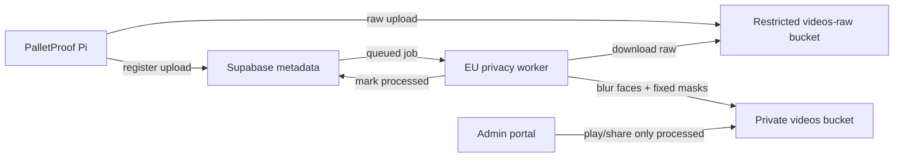

# GDPR og privacy processing

Dette er et teknisk og produktmæssigt oplæg. Det skal valideres juridisk sammen med den dataansvarlige, lagerpartneren og databehandleraftalerne, før PalletProof sælges som produkt.

## Beslutning

Standardmodellen bør være cloud privacy processing i en EU-hostet worker, ikke fuld face-blur på Raspberry Pi.

Pi'en skal prioritere stabil optagelse, lokal kø og upload. Face-blur på Pi'en findes allerede som fallback i `src/pallet_video_recorder/privacy.py`, men det er tungt for Raspberry Pi 5 ved høj opløsning og kan forsinke upload, give varmeproblemer og gøre fejlsøgning sværere. Cloud processing giver bedre kontrol, bedre modeller, retries, audit log og mulighed for at forbedre algoritmen uden at presse alle enhederne.

Cloudflare Pages/Workers bør ikke være selve videoprocessoren. De kan hoste portal og eventuelt trigge/orchestrere jobs, men FFmpeg/OpenCV/ML face detection bør køres i en separat EU-worker med CPU/GPU nok. Eksempler: en lille EU VPS/container-worker til MVP, senere en managed batch/GPU service hvis volumen vokser.

## Anbefalet flow

1. Pi optager og uploader råvideo til en restricted raw bucket.
2. `register_video_upload` markerer videoen som `privacy_status = not_processed` og opretter et `video_privacy_jobs` job.
3. Worker downloader råvideo, kører face detection og slører ansigter med margin omkring detection-boxen.
4. Worker kan også anvende faste masker pr. site/kamera, fx områder hvor medarbejdere typisk går.
5. Den behandlede video uploades til den normale private `videos` bucket.
6. Metadata opdateres til `privacy_status = processed`.
7. Portalens afspilning og deling er kun aktiv, hvis videoen er `processed` eller `not_required`.
8. Råvideo slettes automatisk efter succes, helst inden for 24 timer, medmindre den er markeret til manuel undersøgelse.

## Hvad der allerede er lagt i koden

- Pi'en har lokal privacy processor med OpenCV face blur og faste masker.
- Portalen blokerer nu afspilning og deling af videoer med `privacy_status = not_processed` eller `failed`.
- Supabase har fået `video_privacy_jobs`, raw/processed storage paths og en restricted `videos-raw` bucket.
- Upload-RPC'en kan nu markere cloud-worker videoer som `not_processed`, så de lander i køen.

## GDPR-kontroller

Minimumskontroller for en lagerinstallation:

- Kameraet monteres så det primært ser palle/foliezone og ikke almindelige arbejdsområder.
- Der bruges fysisk kameravinkel og eventuelt afskærmning før software-sløring.
- Medarbejdere og faste besøgende informeres på forhånd om formål, adgang, retention og deling.
- Skiltning skal være på plads, hvis installationen falder under TV-overvågning.
- Adgang til videoer styres med roller og audit log.
- Deling sker via tidsbegrænsede links, ikke permanente storage-links.
- Retention sættes pr. site, og ældste videoer slettes automatisk ved pladsgrænse.
- Råvideo er ikke synlig for site admins og skal kun kunne tilgås af service-role/worker eller platformadmin i nødsituationer.
- Face detection må ikke bruges til identifikation af personer. Formålet er anonymisering, ikke biometrisk genkendelse.

## MVP-worker

Første worker kan være en simpel container:

- Poll `video_privacy_jobs` for `queued`.
- Download råvideo via service-role/signed URL.
- Kør FFmpeg frame processing med OpenCV/MediaPipe/YOLO-face.
- Blur alle detekterede ansigter med stor padding.
- Upload processed MP4.
- Opdater `videos` og `video_privacy_jobs`.
- Slet råvideo efter succes.
- Sæt `privacy_status = failed` og gem fejltekst efter gentagne fejl.

## Kilder tjekket 2026-07-24

- Datatilsynet: optagelser og overvågning, herunder arbejdsplads og oplysningspligt: https://www.datatilsynet.dk/regler-og-vejledning/optagelser-og-overvaagning
- Datatilsynet: TV-overvågning af medarbejdere og krav til saglighed/information: https://www.datatilsynet.dk/afgoerelser/afgoerelser/2022/aug/tv-overvaagning-af-medarbejdere-levede-op-til-gdpr
- EDPB Guidelines 3/2019 om behandling af personoplysninger via video devices: https://www.edpb.europa.eu/documents/guideline/guidelines-32019-on-processing-of-personal-data-through-video-devices_en
